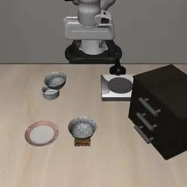
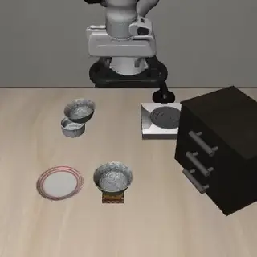
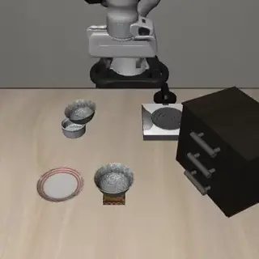
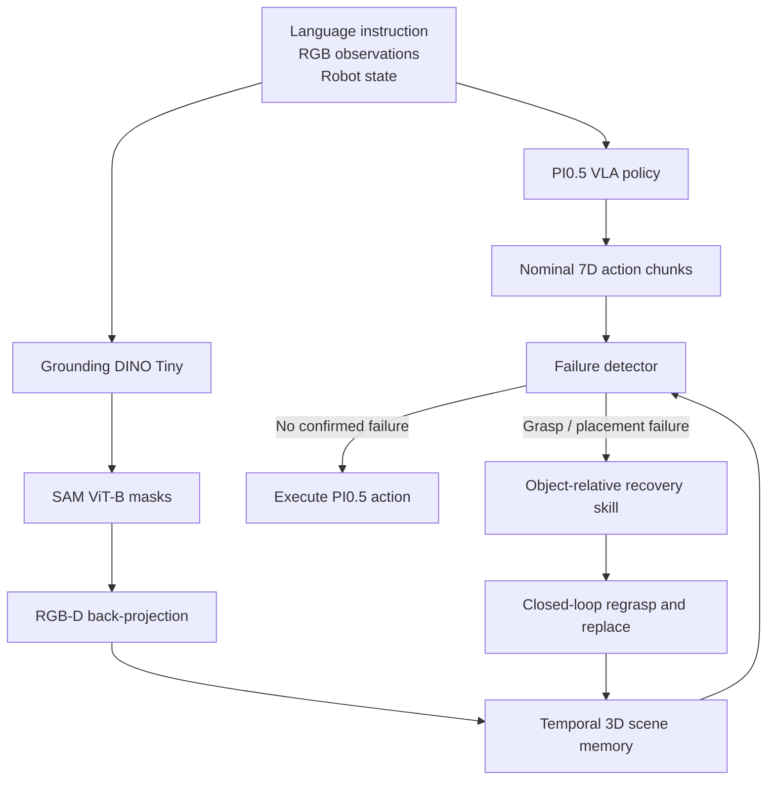
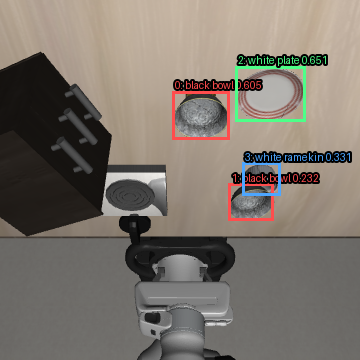
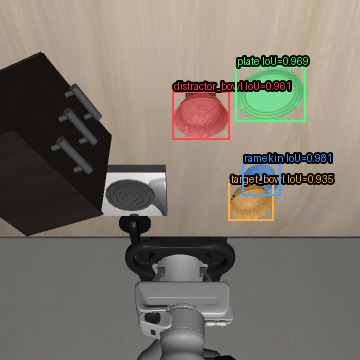

# Failure-Aware Visual Recovery for VLA Manipulation

<p align="center">
  <strong>Selective closed-loop failure detection and recovery for PI0.5 on LIBERO Spatial</strong>
</p>

<p align="center">
  PI0.5 baseline <strong>9/10</strong>
  &nbsp;→&nbsp;
  learned visual recovery <strong>10/10</strong>
  &nbsp;·&nbsp;
  false interventions <strong>0/9</strong>
</p>

## Overview

A pretrained vision-language-action policy can complete most manipulation
rollouts, yet a small final-position error can still turn an otherwise correct
trajectory into a failure. This project augments
`lerobot/pi05_libero_finetuned` with:

- open-vocabulary object detection and instance segmentation;
- multi-view RGB-D 3D scene memory;
- temporally confirmed grasp and placement failure detection;
- object-relative recovery skills that intervene only after failure.

The target benchmark is LIBERO Spatial task 5:

> Pick up the black bowl on the ramekin and place it on the plate.

The final control path does **not** use simulator object positions or oracle
instance masks. Those signals are retained only for offline evaluation.

## Demo

<table>
  <tr>
    <th>Nominal PI0.5 success</th>
    <th>PI0.5 placement failure</th>
    <th>Learned visual recovery</th>
  </tr>
  <tr>
    <td></td>
    <td></td>
    <td></td>
  </tr>
  <tr>
    <td>Policy completes the task without intervention.</td>
    <td>The bowl is grasped and transported but placed outside the success region.</td>
    <td>The learned scene detects failure, regrasps the bowl, and replaces it.</td>
  </tr>
</table>

Full-resolution clips:
[baseline success](media/failure_aware_libero/baseline_success.mp4) ·
[baseline failure](media/failure_aware_libero/baseline_failure.mp4) ·
[learned recovery](media/failure_aware_libero/learned_visual_recovery.mp4)

## System



The 7D policy action contains relative end-effector translation, relative
rotation, and one gripper command. During nominal execution, PI0.5 remains in
control. Recovery actions override the policy only after the detector confirms
a failure over time.

## Learned perception

<p align="center">
  
  
</p>

Grounding DINO Tiny detects two visually identical black bowls, one plate, and
one ramekin. SAM ViT-B converts the boxes to masks, and masked depth pixels are
back-projected into world coordinates using calibrated camera geometry.

| Object | Learned-mask IoU | Static 3D position error |
| --- | ---: | ---: |
| Target bowl | 0.935 | 0.42 cm |
| Distractor bowl | 0.961 | 0.50 cm |
| Plate | 0.969 | 0.05 cm |
| Ramekin | 0.981 | 0.15 cm |

On an RTX 4090, warm median inference latency was:

| Module | Median latency |
| --- | ---: |
| Grounding DINO Tiny | 57.2 ms |
| SAM ViT-B | 59.0 ms |
| Full perception pass | 117.5 ms |

Perception runs every five 20 Hz control steps, or approximately 4 Hz. Between
inference frames, the scene memory uses robot proprioception and end-effector
motion to propagate state.

## Temporal scene memory

Single-frame perception was not sufficient for closed-loop recovery. The scene
memory therefore:

- associates the target and distractor bowls across views and time;
- fuses the fixed agent-view and wrist camera;
- propagates an occluded held object using end-effector motion;
- rejects implausible visual innovations during grasp and transport;
- retains reset-time plate and ramekin positions as static landmarks;
- tracks a monotonic task state:
  `approach → grasp → transport → place → verify_place`;
- declares success or failure only after temporal confirmation.

Shadow-mode evaluation compared the learned scene against simulator ground
truth without allowing the learned scene to control the robot. Representative
successful episodes reached about 95% stage agreement; the failed episode
reached 87.5% stage agreement and 97.5% placement-failure agreement. Ground
truth first confirmed failure at step 99 and the learned scene at step 106.

## Failure-aware recovery

The recovery state machine uses current object-relative positions:

```text
above_bowl
→ descend
→ close
→ lift
→ transport
→ lower
→ open
→ retreat
→ verify
```

Two environment switches select the final learned control path:

```text
LEARNED_VISION_DETECTOR=1
LEARNED_VISION_RECOVERY_TARGETS=1
```

They make the learned scene responsible for both:

1. deciding whether recovery is required;
2. supplying the target bowl and plate positions used by the controller.

## Results

All results below are observed on one fixed 10-episode evaluation set for
LIBERO Spatial task 5.

| Configuration | Success | Purpose |
| --- | ---: | --- |
| PI0.5 baseline | 9/10 | Establish the nominal policy result |
| Simulator-state recovery | 10/10 | Validate failure logic and recovery skills |
| Oracle-mask RGB-D recovery | 10/10 | Validate camera geometry and visual control |
| Learned-mask RGB-D recovery | **10/10** | Final Grounding DINO + SAM control path |

In the final learned-perception evaluation:

- episode 2 recovered from a placement failure using 116 overridden actions;
- the other nine episodes received zero recovery actions;
- false recovery interventions on nominal successes were 0/9;
- observed failed episodes recovered were 1/1;
- success increased from 9/10 to 10/10 on this evaluation set.

This is selective intervention, not a scripted replacement for the VLA policy.

## Reproduce the final evaluation

Run from the LeRobot Conda environment:

```bash
PLACE_RECOVERY=1 \
LEARNED_VISION_DETECTOR=1 \
LEARNED_VISION_RECOVERY_TARGETS=1 \
LEARNED_VISION_INTERVAL=5 \
TRACE_OUT=./task5_learned_closed_loop_trace_n10 \
MUJOCO_GL=egl \
PYOPENGL_PLATFORM=egl \
python task5_trace.py \
  --output_dir=./eval_task5_learned_closed_loop_n10 \
  --job_name=task5_learned_closed_loop_n10 \
  --policy.path=lerobot/pi05_libero_finetuned \
  --policy.n_action_steps=10 \
  --policy.device=cuda \
  --env.type=libero \
  --env.task=libero_spatial \
  --env.task_ids='[5]' \
  --eval.batch_size=1 \
  --eval.n_episodes=10 \
  --eval.use_async_envs=false \
  --env.max_parallel_tasks=1
```

## Code map

| File | Responsibility |
| --- | --- |
| `task5_trace.py` | Evaluation wrapper, action override, and per-step traces |
| `scene_memory.py` | Simulator-state scene memory used for validation |
| `vision_scene_memory.py` | Oracle-mask RGB-D scene memory |
| `learned_mask_perception.py` | Persistent Grounding DINO and SAM inference |
| `learned_vision_scene_memory.py` | Learned-mask multi-view temporal 3D memory |
| `failure_detector.py` | Temporally confirmed grasp and placement failures |
| `placement_recovery.py` | Object-relative recovery state machine |
| `analyze_scene_traces.py` | Ground-truth trace analysis |
| `analyze_vision_shadow.py` | Learned-scene versus ground-truth evaluation |
| `benchmark_task5_learned_perception.py` | Perception latency benchmark |
| `inspect_task5_*.py` | Camera, mask, detection, and back-projection diagnostics |

## Development progression

```text
PI0.5 baseline and rollout traces
→ simulator-state semantic scene memory
→ grasp and placement failure detectors
→ object-relative recovery
→ oracle-mask RGB-D validation
→ Grounding DINO + SAM perception
→ temporal learned 3D scene memory
→ learned closed-loop recovery
```

## Limitations

- The closed-loop result covers one LIBERO task and ten fixed episodes.
- Only one failure in the final set required learned recovery.
- Recovery skills and several thresholds remain task-specific.
- Depth is rendered by the simulator.
- Static plate and ramekin landmarks assume a stationary scene.
- Multi-seed, perturbation, and real-robot evaluation remain future work.

The supported claim is therefore:

> On one fixed 10-episode LIBERO Spatial task 5 evaluation, learned visual
> recovery improved observed success from 9/10 to 10/10 without intervening in
> the other nine nominally successful rollouts.

## Next steps

1. Run multi-seed evaluation and controlled failure injection.
2. Extend the scene-memory schema and recovery interfaces to more LIBERO tasks.
3. Replace task-specific offsets with geometry-derived or learned estimates.
4. Expose recovery skills through ROS 2 actions.
5. Transfer the pipeline to a real RGB-D mobile manipulator.
